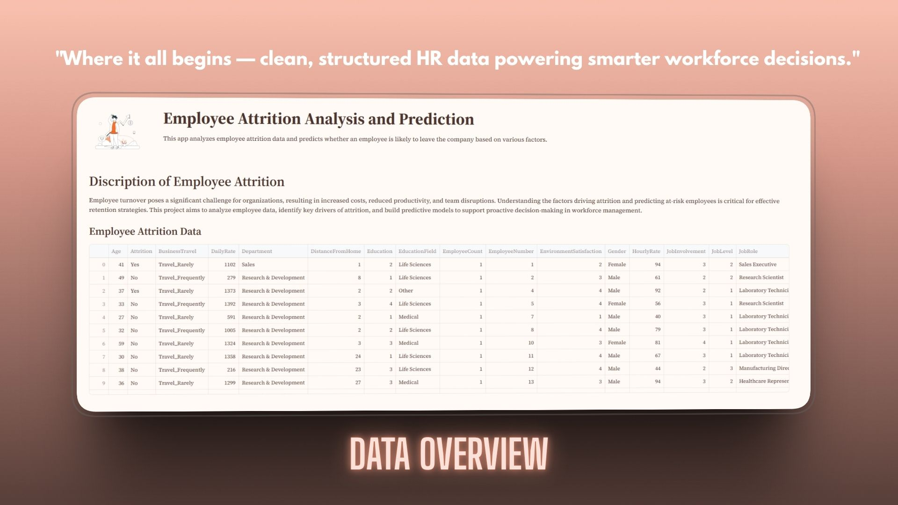
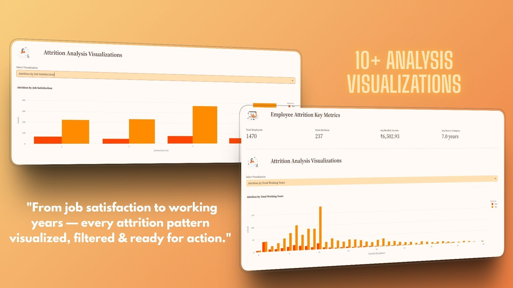
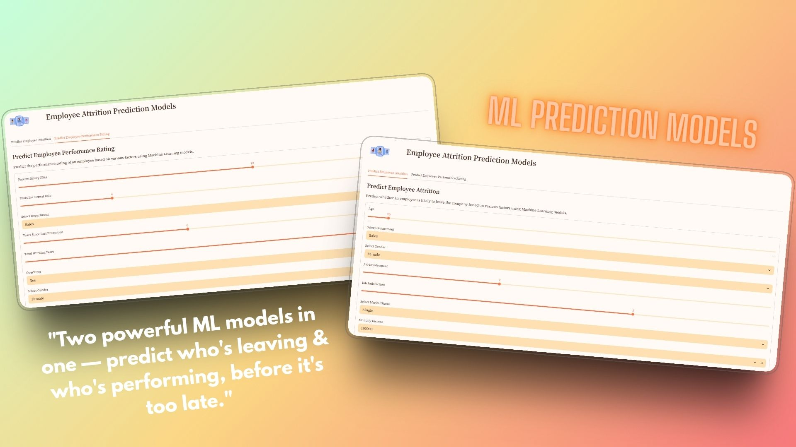

# 🧑‍💼 Employee Attrition Analysis & Prediction

A machine learning project designed to analyze employee attrition and build predictive models that help organizations understand which employees are at risk of leaving.

---

## 📌 Project Overview

Employee attrition is a major concern for companies. This project focuses on:

- Understanding factors influencing employee attrition using **Exploratory Data Analysis (EDA)**  
- Preprocessing and cleaning real HR employee datasets  
- Training machine learning models to predict attrition  
- Saving and reusing the trained ML model using **joblib**  

## 📌 Project Outputs






---

## 🚀 Features

- ✔️ Clean and preprocess HR dataset  
- ✔️ Exploratory Data Analysis with charts and insights  
- ✔️ Feature Encoding and Scaling  
- ✔️ Train ML models (Logistic Regression, RandomForest, etc.)  
- ✔️ Evaluation Metrics (Accuracy, Precision, Recall, F1-score)  
- ✔️ Confusion Matrix Visualization  
- ✔️ Save trained model using **joblib**  


## 🧠 Methodology

### 1️⃣ Data Preprocessing
- Handling missing values  
- Label encoding (categorical variables)  
- Feature scaling  
- Train/Test split  

### 2️⃣ Exploratory Data Analysis (EDA)
- Attrition distribution  
- Age, Income, JobRole insights  
- Correlation heatmap  
- Attrition by department and job role  

### 3️⃣ Model Training
Models used:
- Logistic Regression  
- Decision Tree Classifier  
- Random Forest Classifier  
- Gradient Boosting Classifier
- Light Gradient Boosting Classifier

### 4️⃣ Model Evaluation
Metrics analyzed:
- Accuracy  
- Precision  
- Recall  
- F1 Score  
- Confusion Matrix  

### 5️⃣ Model Saving
Trained models are saved using:
```python
joblib.dump(model, "Joblib/model.joblib")
